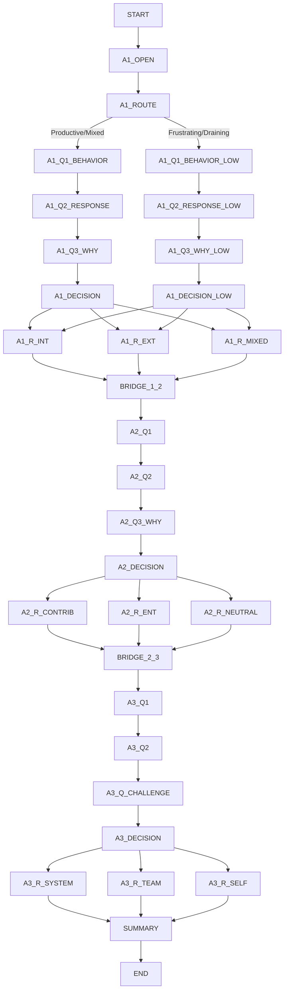

```mermaid
graph TD

START --> A1_OPEN
A1_OPEN --> A1_ROUTE

A1_ROUTE -->|Productive/Mixed| A1_Q1_BEHAVIOR
A1_ROUTE -->|Frustrating/Draining| A1_Q1_BEHAVIOR_LOW

A1_Q1_BEHAVIOR --> A1_Q2_RESPONSE
A1_Q1_BEHAVIOR_LOW --> A1_Q2_RESPONSE_LOW

A1_Q2_RESPONSE --> A1_Q3_WHY
A1_Q2_RESPONSE_LOW --> A1_Q3_WHY_LOW

A1_Q3_WHY --> A1_DECISION
A1_Q3_WHY_LOW --> A1_DECISION_LOW

A1_DECISION --> A1_R_INT
A1_DECISION --> A1_R_EXT
A1_DECISION --> A1_R_MIXED

A1_DECISION_LOW --> A1_R_INT
A1_DECISION_LOW --> A1_R_EXT
A1_DECISION_LOW --> A1_R_MIXED

A1_R_INT --> BRIDGE_1_2
A1_R_EXT --> BRIDGE_1_2
A1_R_MIXED --> BRIDGE_1_2

BRIDGE_1_2 --> A2_Q1
A2_Q1 --> A2_Q2
A2_Q2 --> A2_Q3_WHY
A2_Q3_WHY --> A2_DECISION

A2_DECISION --> A2_R_CONTRIB
A2_DECISION --> A2_R_ENT
A2_DECISION --> A2_R_NEUTRAL

A2_R_CONTRIB --> BRIDGE_2_3
A2_R_ENT --> BRIDGE_2_3
A2_R_NEUTRAL --> BRIDGE_2_3

BRIDGE_2_3 --> A3_Q1
A3_Q1 --> A3_Q2
A3_Q2 --> A3_Q_CHALLENGE
A3_Q_CHALLENGE --> A3_DECISION

A3_DECISION --> A3_R_SYSTEM
A3_DECISION --> A3_R_TEAM
A3_DECISION --> A3_R_SELF

A3_R_SYSTEM --> SUMMARY
A3_R_TEAM --> SUMMARY
A3_R_SELF --> SUMMARY

SUMMARY --> END
```
